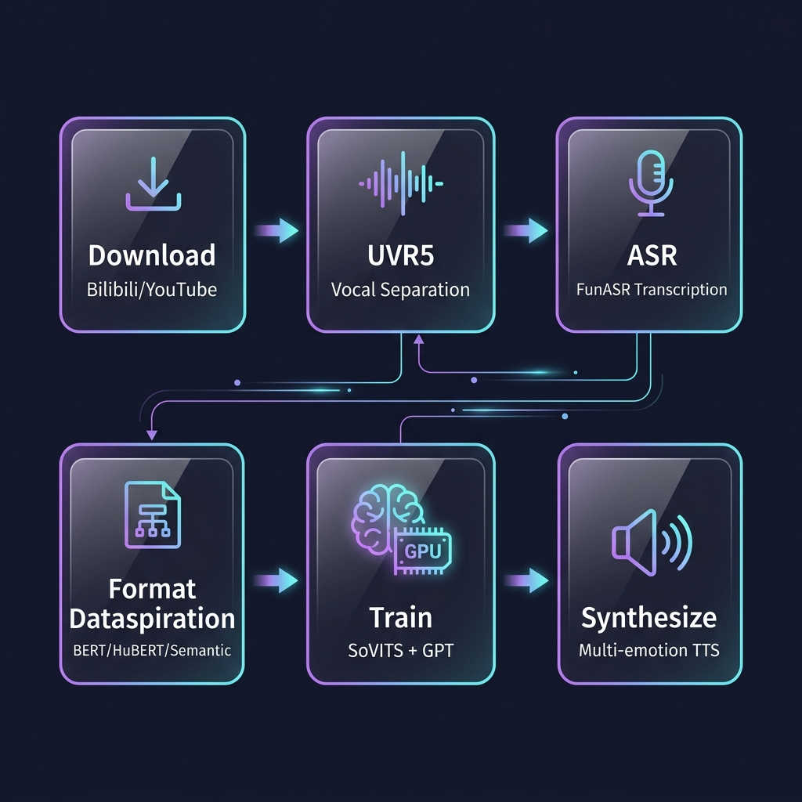

<p align="center">
  
</p>

<h1 align="center">GPT-SoVITS Galgame Pipeline</h1>

<p align="center">
  <strong>从一个视频链接到 Galgame 角色配音，全程自动化</strong>
</p>

<p align="center">
  <a href="README_EN.md">English</a> | 中文
</p>

<p align="center">
  <a href="#快速开始"></a>
  <a href="https://github.com/RVC-Boss/GPT-SoVITS"></a>
  <a href="LICENSE"></a>
</p>

---

## 这个项目做什么？

你有没有想过：**把你喜欢的 VTuber / 声优 / 角色的声音，克隆到 Galgame 台词上？**

这个工具就是干这个的。给它一个 B站 或 YouTube 的视频链接，它会自动完成：

1. 下载视频音频
2. 用 UVR5 AI 分离人声（去掉 BGM）
3. 用 FunASR 做语音识别和自动切片
4. 提取 BERT / HuBERT / Semantic Token 特征
5. 训练 SoVITS V4 LoRA + GPT 模型
6. 合成多情感的 Galgame 台词语音

**整个过程只需要一条命令。**

<!-- TODO: 在这里放效果试听 -->
<!-- > 🔊 **效果试听**：[点击收听 demo 音频](链接) -->

---

## 管线架构

<p align="center">
  
</p>

```
视频链接 → 下载音频 → UVR5 人声分离 → FunASR 语音识别
    → BERT/HuBERT/Semantic 特征提取 → SoVITS+GPT 训练 → 多情感台词合成
```

---

## 环境要求

| 组件 | 要求 |
|---|---|
| GPU | NVIDIA ≥ 16GB VRAM（推荐 RTX 3090 / 4090） |
| GPT-SoVITS | [v4 版本](https://github.com/RVC-Boss/GPT-SoVITS)，需提前装好 |
| Python | 3.10+（GPT-SoVITS 自带的 runtime 就行） |
| yt-dlp | 用来下载 B站 / YouTube 音频 |
| OS | Windows 10/11（主要测试平台） |

---

## 快速开始

### 安装

```bash
git clone https://github.com/lhfer/GPT-SoVITS-Galgame-Pipeline.git
cd GPT-SoVITS-Galgame-Pipeline

# 安装 uv（如果还没有的话）
pip install uv
```

### 一条命令跑完全流程

```bash
uv run scripts/galgame_voice.py pipeline \
  --url "https://www.bilibili.com/video/BVxxxxxx" \
  --speaker "角色名" \
  --output ./output
```

跑完之后，合成的语音文件在 `./output/galgame_audio/` 目录下。

### 分步执行

<details>
<summary>如果你想一步步来，或者需要调参数，展开看这里</summary>

```bash
# 1. 检查环境是否 OK
uv run scripts/galgame_voice.py setup --output ./setup_report.json

# 2. 下载音频
uv run scripts/galgame_voice.py download \
  --url "https://www.bilibili.com/video/BVxxxxxx" \
  --speaker "角色名" \
  --output ./download_report.json

# 3. 预处理（UVR5 分离人声 + 切片 + 语音识别）
uv run scripts/galgame_voice.py preprocess \
  --input ./raw_audio/audio.wav \
  --speaker "角色名" \
  --output ./preprocess_report.json

# 4. 格式化训练数据
uv run scripts/galgame_voice.py format \
  --speaker "角色名" \
  --output ./format_report.json

# 5. 训练模型
uv run scripts/galgame_voice.py train \
  --speaker "角色名" \
  --sovits-epochs 4 \
  --gpt-epochs 15 \
  --output ./train_report.json

# 6. 合成 Galgame 台词
uv run scripts/galgame_voice.py synthesize \
  --speaker "角色名" \
  --output ./galgame_output
```

</details>

> **Tips**: 如果你已经有了干净的音频文件（不需要从视频下载），直接跳过第 2 步，从 `preprocess` 开始，用 `--input` 指定你的音频路径。

---

## 内置台词

项目内置了 12 条 Galgame 经典台词，覆盖 8 种情感场景（日常、告白、战斗、温柔、傲娇、搞笑、离别、重逢）。

你也可以自定义台词，参考 [examples/custom_lines_example.json](examples/custom_lines_example.json)，然后用 `--lines` 参数指定你的文件。

<details>
<summary>查看内置台词列表</summary>

| 场景 | 台词 |
|---|---|
| 日常 | 「早上好啊，今天天气真不错呢。要不要一起去学校后面的咖啡厅坐坐？」 |
| 告白 | 「那个……我有件事情想跟你说。其实……从很久以前开始，我就一直……喜欢你。」 |
| 战斗 | 「就算前方是绝路，我也不会退缩！为了保护你，我愿意赌上一切！」 |
| 温柔 | 「别哭了。不管发生什么事情，我都会陪在你身边的。所以，不用害怕。」 |
| 傲娇 | 「才、才不是因为担心你才来的！只是正好路过而已……别误会了！」 |
| 搞笑 | 「等等等等！那个不是我的！你听我解释！事情不是你想的那样啊！」 |
| 离别 | 「如果有一天我不在了……你要好好照顾自己。答应我，要幸福地活下去。」 |
| 重逢 | 「真的是你吗！太好了！我一直在找你，终于又见面了！」 |

</details>

---

## 自动 V4→V2 回退

这是踩了不少坑总结出来的一个机制：

当训练数据量不够的时候（比如只有 1-3 分钟），V4 SoVITS LoRA 推理出来的音频可能会特别短（不到 1 秒），根本没法用。管线会在合成第一句台词之后自动检测音频时长，如果发现太短，就自动切换到 **V2 SoVITS 预训练模型 + 微调过的 GPT** 这个组合——实测这个方案在小数据量下效果好得多。

具体的踩坑经验和参数推荐见 [docs/best_practices.md](docs/best_practices.md)。

---

## 数据量与效果

| 数据量 | 效果 | 来源建议 |
|---|---|---|
| 1-3 分钟 | 基本可用，音色有偏差 | 1 个短视频 |
| 3-10 分钟 | 不错 | 1-2 个视频 |
| 10-30 分钟 | 很好，音色还原度高 | 多个视频拼接 |
| 30+ 分钟 | 专业级 | 采访、演讲、直播切片 |

---

## 常见问题

**Q: RTX 4090 训练要多久？**

SoVITS 4 epochs + GPT 15 epochs，大约 5-15 分钟，取决于数据量。

**Q: 支持英文 / 日语吗？**

目前默认中文。GPT-SoVITS 本身支持多语言，改一下 ASR 和推理的语言参数就行。

**Q: 合成出来的音频特别短怎么办？**

大概率是 V4 LoRA 在小数据集下的兼容性问题，管线会自动回退 V2。如果还是有问题，多加点训练数据。

**Q: 端口 9874 和 9872 是什么关系？**

9874 是 WebUI 训练界面，9872 是推理 API。合成用的是 9872，千万别连错了。

---

## 项目结构

```
GPT-SoVITS-Galgame-Pipeline/
├── README.md                 # 你正在看的文件
├── README_EN.md              # English version
├── LICENSE                   # MIT
├── scripts/
│   ├── galgame_voice.py      # 主脚本（~980 行）
│   └── default_lines.json    # 内置 12 条 Galgame 台词
├── docs/
│   └── best_practices.md     # 踩坑记录和参数推荐
├── examples/
│   └── custom_lines_example.json
└── assets/
    ├── banner.png
    └── pipeline.png
```

---

## 致谢

- [GPT-SoVITS](https://github.com/RVC-Boss/GPT-SoVITS) — 核心 TTS 引擎
- [UVR5](https://github.com/Anjok07/ultimatevocalremovergui) — AI 人声分离
- [FunASR](https://github.com/modelscope/FunASR) — 语音识别
- [yt-dlp](https://github.com/yt-dlp/yt-dlp) — 视频音频下载

## License

[MIT](LICENSE)
