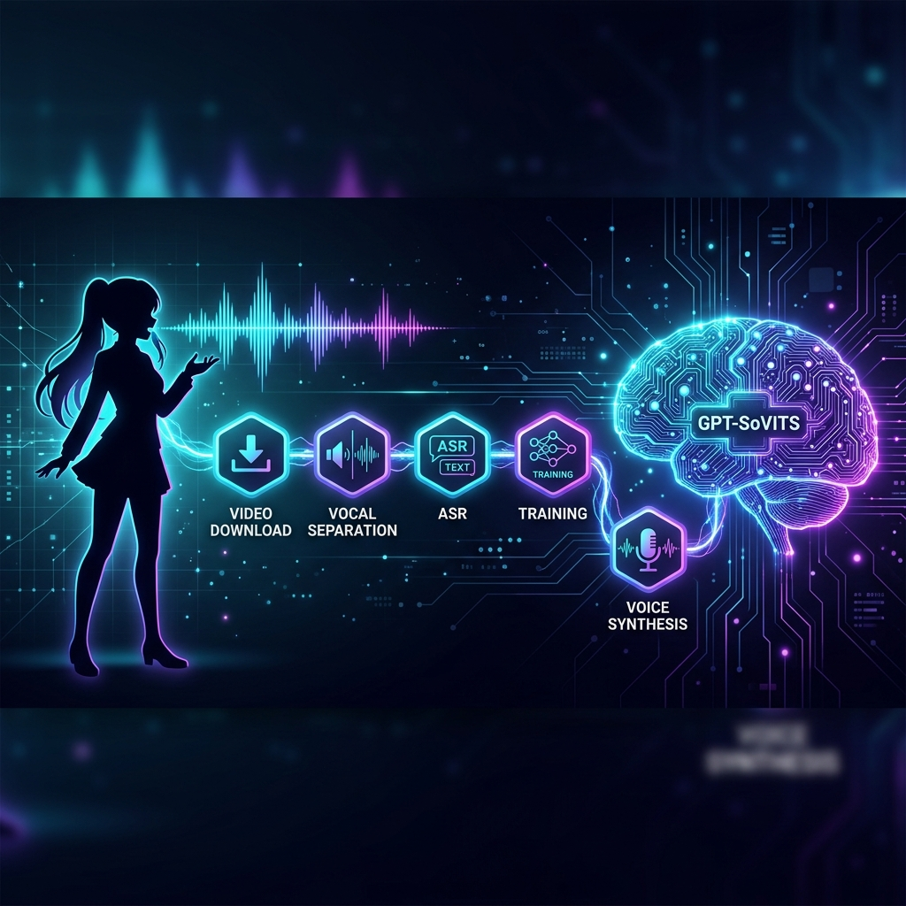

<p align="center">
  
</p>

<h1 align="center">GPT-SoVITS Galgame Pipeline</h1>

<p align="center">
  <strong>From a video URL to Galgame character voices — fully automated</strong>
</p>

<p align="center">
  English | <a href="README.md">中文</a>
</p>

<p align="center">
  <a href="#quick-start"></a>
  <a href="https://github.com/RVC-Boss/GPT-SoVITS"></a>
  <a href="LICENSE"></a>
</p>

---

## What is this?

A CLI tool that clones a speaker's voice from a Bilibili/YouTube video and generates multi-emotion Galgame (visual novel) dialogue lines. The full pipeline runs with a single command:

1. Download audio from video URL (via yt-dlp)
2. Separate vocals with UVR5 AI
3. Transcribe and slice with FunASR
4. Extract BERT / HuBERT / Semantic Token features
5. Train SoVITS V4 LoRA + GPT speaker model
6. Synthesize 12 dialogue lines across 8 emotions

Built on top of [GPT-SoVITS v4](https://github.com/RVC-Boss/GPT-SoVITS).

---

## Requirements

| Component | Requirement |
|---|---|
| GPU | NVIDIA ≥ 16GB VRAM (RTX 3090 / 4090 recommended) |
| GPT-SoVITS | [v4](https://github.com/RVC-Boss/GPT-SoVITS), must be pre-installed |
| Python | 3.10+ (GPT-SoVITS bundled runtime works) |
| yt-dlp | For downloading audio from video URLs |
| OS | Windows 10/11 (primary test platform) |

---

## Quick Start

```bash
git clone https://github.com/lhfer/GPT-SoVITS-Galgame-Pipeline.git
cd GPT-SoVITS-Galgame-Pipeline
pip install uv
```

### One-command full pipeline

```bash
uv run scripts/galgame_voice.py pipeline \
  --url "https://www.bilibili.com/video/BVxxxxxx" \
  --speaker "character_name" \
  --output ./output
```

Output WAV files will be in `./output/galgame_audio/`.

### Step-by-step

<details>
<summary>Click to expand individual steps</summary>

```bash
# 1. Environment check
uv run scripts/galgame_voice.py setup --output ./setup_report.json

# 2. Download audio
uv run scripts/galgame_voice.py download \
  --url "https://www.bilibili.com/video/BVxxxxxx" \
  --speaker "character_name" \
  --output ./download_report.json

# 3. Preprocess (UVR5 + slicing + ASR)
uv run scripts/galgame_voice.py preprocess \
  --input ./raw_audio/audio.wav \
  --speaker "character_name" \
  --output ./preprocess_report.json

# 4. Format training data
uv run scripts/galgame_voice.py format \
  --speaker "character_name" \
  --output ./format_report.json

# 5. Train model
uv run scripts/galgame_voice.py train \
  --speaker "character_name" \
  --sovits-epochs 4 \
  --gpt-epochs 15 \
  --output ./train_report.json

# 6. Synthesize dialogue lines
uv run scripts/galgame_voice.py synthesize \
  --speaker "character_name" \
  --output ./galgame_output
```

</details>

---

## Automatic V4→V2 Fallback

When training data is limited (<3 minutes), V4 SoVITS LoRA may produce very short audio (<1.5s). The pipeline detects this after synthesizing the first test line and automatically switches to **V2 SoVITS pretrained + fine-tuned GPT** — which works much better with small datasets.

See [docs/best_practices.md](docs/best_practices.md) for detailed parameter recommendations and troubleshooting.

---

## Data Volume vs Quality

| Audio Data | Expected Quality | Suggested Source |
|---|---|---|
| 1-3 min | Usable, some timbre drift | 1 short video |
| 3-10 min | Good | 1-2 videos |
| 10-30 min | Great, high fidelity | Multiple videos |
| 30+ min | Professional | Interviews, streams |

---

## FAQ

**Q: How long does training take on RTX 4090?**
SoVITS 4 epochs + GPT 15 epochs ≈ 5-15 minutes depending on data volume.

**Q: Does it support English / Japanese?**
Currently defaults to Chinese. GPT-SoVITS supports multiple languages — adjust the ASR and inference language parameters.

**Q: Can I use my own audio files?**
Yes. Skip the `download` step and start from `preprocess` with `--input your_audio.wav`.

---

## Acknowledgements

- [GPT-SoVITS](https://github.com/RVC-Boss/GPT-SoVITS) — Core TTS engine
- [UVR5](https://github.com/Anjok07/ultimatevocalremovergui) — AI vocal separation
- [FunASR](https://github.com/modelscope/FunASR) — Speech recognition
- [yt-dlp](https://github.com/yt-dlp/yt-dlp) — Video audio download

## License

[MIT](LICENSE)
